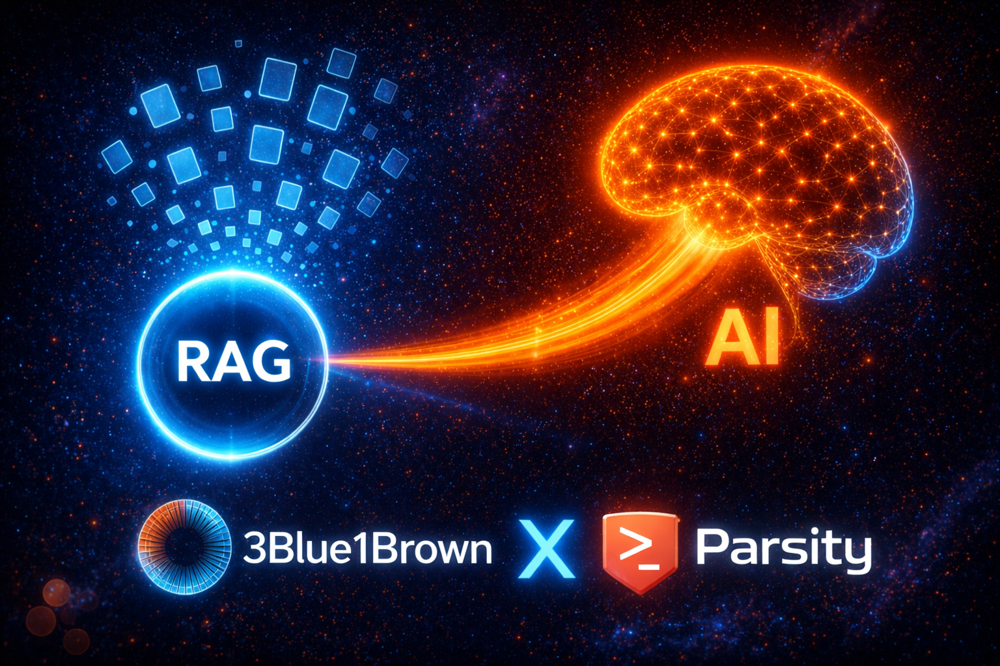

# Parsity AI Compendium
A [visual guide](https://scurrlin.github.io/AI_Compendium/) to the building blocks of AI

## About

The Parsity AI Compendium is a simplified adaptation of six [3Blue1Brown](https://www.3blue1brown.com/) lessons that serve as the theoretical bedrock for [Parsity's](https://parsity.io/) AI Accelerator. Each chapter distills a core concept from either linear algebra or deep learning into a concise, visual explanation. The interactive quizzes from the source material have been removed and key concepts have been highlighted to keep the subject matter as frictionless as possible.

If you have the time, I highly recommend checking out the original lessons from 3Blue1Brown. They are a great way to deepen your understanding of the concepts covered in this compendium.

## Chapters

1. [Vectors](https://scurrlin.github.io/AI_Compendium/vectors/)
2. [Linear Combinations, Span, and Basis](https://scurrlin.github.io/AI_Compendium/span/)
3. [Dot Products and Duality](https://scurrlin.github.io/AI_Compendium/dot-products/)
4. [LLMs Explained](https://scurrlin.github.io/AI_Compendium/mini-llm/)
5. [Transformers (GPT)](https://scurrlin.github.io/AI_Compendium/gpt/)
6. [Attention in Transformers](https://scurrlin.github.io/AI_Compendium/attention/)